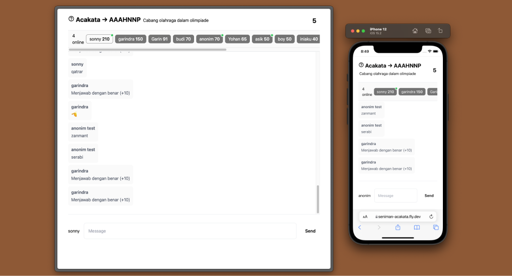

# Seniman Acakata

Real-time multiplayer game using [Seniman Javascript Framework](https://github.com/senimanjs/seniman).

Messages are stored in server memory and synced with client with [Valtio](https://github.com/pmndrs/valtio). Leaderboard data stored in [Supabase](https://supabase.com).



## Developing

Copy your `<supabase_url>` & `<supabase_key>` from [Supabase](https://app.supabase.com)

Create new table `leaderboard` in Supabase, add fields:

- `player` (text) as primary key
- `score` (int8)

```
npm run watch
npm run style
SUPABASE_URL=<supabase_url> SUPABASE_KEY=<supabase_key> npm start
```

## Deploying

The easiest way to deploy is using [Fly](https://fly.dev/)

```
flyctl deploy
```
